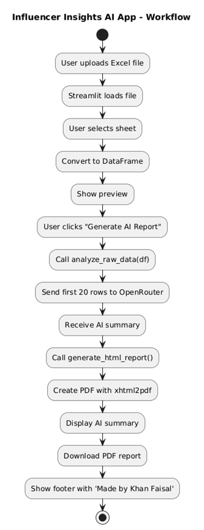

# 🤖 Insights AI App

This AI-powered Streamlit app analyzes influencer marketing data and generates automated summary reports using the OpenRouter API (LLaMA 3). It dynamically accepts any Excel file, detects sheet and structure, and provides structured insights + a downloadable PDF.

---

📌 Live Demo: [Open Link](https://influencer-insights.streamlit.app)

---

## 🧠 Workflow



## 🚀 Features

- Upload any Excel (.xlsx) file with influencer campaign data
- Automatically detects sheet & column structure
- Uses LLaMA 3 via OpenRouter to generate insights:
  - Best influencers to scale
  - Poor performers to pause
  - Optimization strategies
- Displays a structured, readable AI summary
- Generates a visually appealing downloadable PDF report
- Fully branded: **Made by Khan Faisal** – [https://khanfaisal.netlify.app](https://khanfaisal.netlify.app)

---

## 📁 Project Structure

```
influencer_insights_ai/
├── app.py # Main Streamlit app
├── config.py # OpenRouter API key setup
├── utils/
│ ├── ranker.py # AI logic using OpenRouter (LLaMA)
│ └── report_generator.py # PDF report generator
```

---

## ⚙️ Setup Instructions

1. **Clone the repository**:

```bash
git clone https://github.com/your-username/influencer-insights-ai.git
cd influencer-insights-ai
Install dependencies:
```

2. **Download Dependencies**:
```bash
pip install -r requirements.txt
```

3. **Add YOUR API KEY**
```bash
OPENROUTER_API_KEY = "your_openrouter_api_key_here"
Run the app:
```

4. **Run the script**
```bash
streamlit run app.py
```
### 🧠 Powered by
OpenRouter.ai – Using meta-llama/llama-3-70b-instruct


### 📎 Portfolio
Made by Khan Faisal
🔗 [Portfolio](https://khanfaisal.netlify.app)

